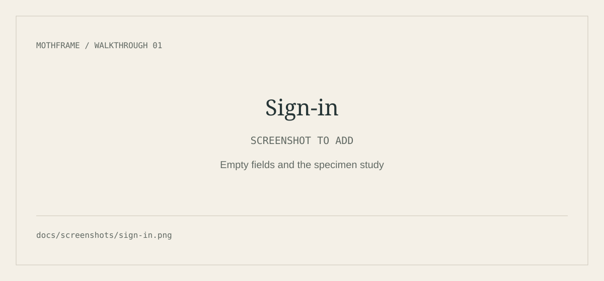
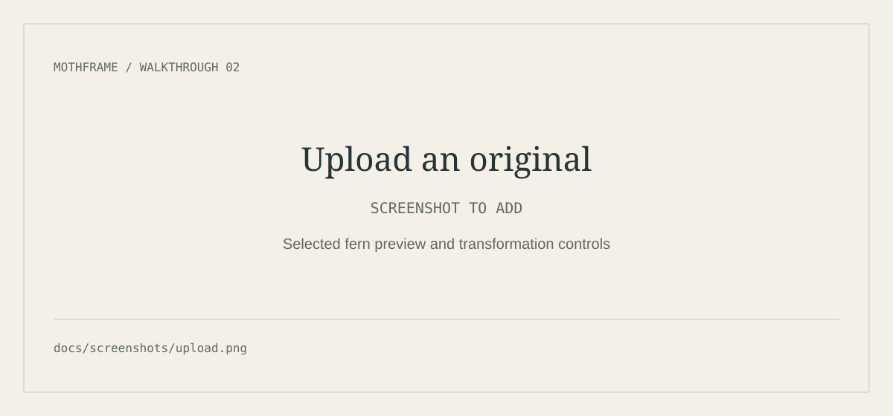
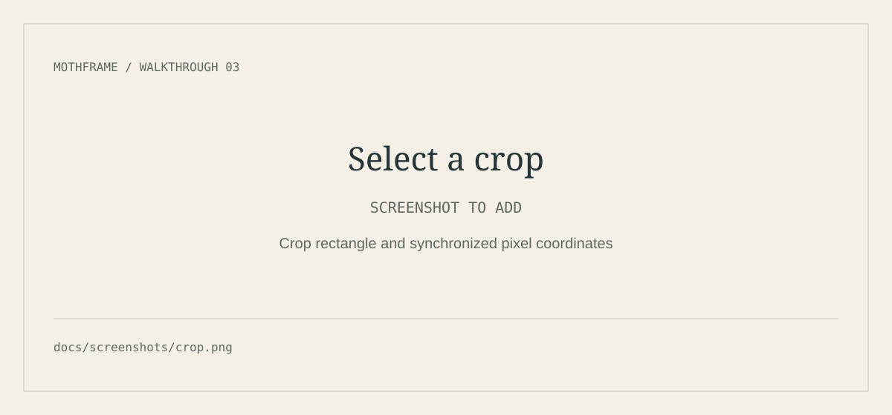
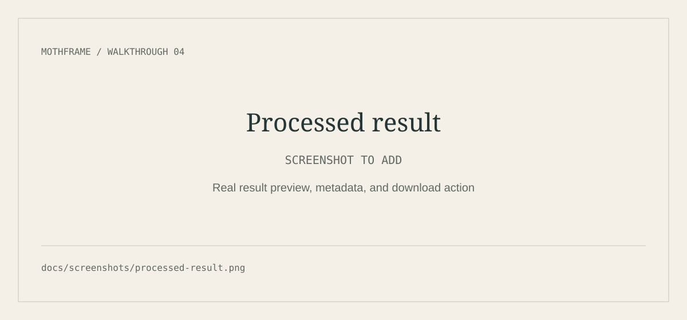

# Mothframe

**An image-processing workspace presented as a natural-history archive.**

Upload an original image, define a transformation, and keep both the original
and its processed versions. Warm paper colors, scientific engravings, serif
headings, and specimen labels give Mothframe its archival character.

## Project links

| Destination | Link |
| --- | --- |
| Live frontend · Vercel | **TODO_FRONTEND_URL — add the production URL from your Vercel project.** |
| Frontend repository | [ananotopuria/image-processing-service-frontend](https://github.com/ananotopuria/image-processing-service-frontend) |
| Backend repository | [ananotopuria/image-processing-service](https://github.com/ananotopuria/image-processing-service) |
| Backend API · Render | [Image Processing Service](https://image-processing-service-s34x.onrender.com) |
| Swagger documentation | [Interactive API documentation](https://image-processing-service-s34x.onrender.com/api/docs) |

The frontend URL is not recorded in the repository or `vercel.json`; its
placeholder is intentional. Backend links come from the backend README and
Swagger configuration, rather than a guarantee of current service availability.

> **For reviewers:** the NestJS backend runs on Render's free plan. Its first
> request after inactivity may take about a minute. Keep the page open while it
> starts. After eight seconds, the frontend explains the possible delay and keeps
> the request running for up to two minutes.

## Features

- Registration, sign-in, protected routes, and session restoration.
- Drag-and-drop JPEG, PNG, and WebP uploads with format/size validation:
  one file, strictly less than 5 MiB.
- Visual cropping with `react-image-crop`: draw, move, resize, reset, or
  disable a selection, synchronized with original-image pixel coordinates.
- Resize, rotate, flip, mirror, grayscale, sepia, output quality, and format
  controls. Crop and resize dimensions support 1–4000 pixels.
- Processed-image previews, actual dimensions and file sizes, applied
  transformation details, and downloads.
- An archive with grouped originals/versions, pagination, temporary-link
  refresh, and confirmed deletion.
- Responsive layouts, keyboard controls, focus indicators, and reduced-motion
  support.
- A landing-page comparison of the original and optimized fern illustration.

Pricing is a presentation/demo page; billing and subscriptions are not implemented.

## Visual walkthrough

**These are labeled placeholders, not screenshots or mock results.** Replace
them with captures of the real running app. Use the project-owned
`src/assets/fern-transformation.jpg` or another image you may publish.
Capture only the application viewport: omit developer tools, credentials,
tokens, signed image URLs, and private user images. Leave sign-in fields empty
and conceal any visible account identity.

### 1. Sign in



Capture `/login` with the specimen illustration, heading, and empty form.
Save as **`docs/screenshots/sign-in.png`** and update the image link above.

### 2. Upload an original



Capture `/upload` after selecting the safe fern image. Include its preview,
transformation controls, and Process image action.
Save as **`docs/screenshots/upload.png`** and update the image link above.

### 3. Select a crop



On `/upload`, expand Crop, enable it, and draw a rectangle. Include the
selection and synchronized X, Y, width, and height fields.
Save as **`docs/screenshots/crop.png`** and update the image link above.

### 4. Review the processed result



Submit an actual transformation of the safe image. Capture the success state on
`/upload`: “A new form, ready,” result preview, real metadata, and download
action. This is an upload-page state, not a separate route.
Save as **`docs/screenshots/processed-result.png`** and update the image link above.

A desktop capture around 1440 × 1000 is a useful starting point. An optional
390-pixel-wide capture can demonstrate the stacked mobile layout.

## Tech stack

| Layer | Technology |
| --- | --- |
| UI | React 19, TypeScript 6 |
| Build | Vite 8 |
| Routing | React Router 7 |
| Styling | Tailwind CSS 4, Lucide icons |
| Visual crop | react-image-crop 11 |
| HTTP | Axios |
| Checks | TypeScript, ESLint, Node's test runner and mocked API transport |
| Frontend hosting | Vercel |
| Separate backend | NestJS, Sharp, MongoDB, S3; hosted on Render |

This is a Vite single-page application, not a Next.js application.

## Local setup

Prerequisites: Node.js **22.12 or newer**, npm, and access to the deployed backend
or a running copy of the [backend repository](https://github.com/ananotopuria/image-processing-service).

```sh
git clone https://github.com/ananotopuria/image-processing-service-frontend.git
cd image-processing-service-frontend
npm ci
cp .env.example .env
```

Set this in `.env`:

```dotenv
VITE_API_URL=https://image-processing-service-s34x.onrender.com
```

For a local backend, use `VITE_API_URL=http://localhost:3000` instead and follow
the backend's setup instructions. Then:

```sh
npm run dev
```

Open the URL printed by Vite, normally `http://localhost:5173`. Register your own
demo account or sign in with an existing one. Shared credentials are not included.

### Environment variables

| Variable | Required | Purpose |
| --- | --- | --- |
| `VITE_API_URL` | Yes | Absolute HTTP(S) backend **origin only**, without `/api`, credentials, query, or fragment. |

The client adds paths such as `/api/auth/sign-in`. Vite embeds this public URL
at build time: restart development or rebuild after changing it. Never put JWT
signing keys, database credentials, S3 keys, or other secrets in `VITE_*` variables.
Local `.env` files are ignored by Git.

The backend's `CORS_ORIGINS` must allow the exact frontend origin. For development
this is normally `http://localhost:5173`; if Vite picks another port, allow that
origin too. CORS configuration belongs to the backend.

## Run, build, and test

```sh
npm run dev           # Development server
npm run build         # TypeScript checks; production bundle in dist/
npm run preview       # Serve the production build locally
npm run lint
npm run test:auth
npm run test:images
npm run test:pricing
```

Tests use synthetic images, test-only account data, fake timers, and mocked API
adapters. They do not create live accounts or upload files to S3. Browser screenshots
and live backend availability are separate checks.

## Backend relationship

Vercel serves the UI; it does not run the image processor or proxy API requests.
The frontend calls the separate NestJS service directly:

1. Authentication returns a Bearer access token. This implementation stores it in
   browser localStorage and verifies restored sessions through the profile
   endpoint. Passwords are not persisted.
2. The original `File` goes to `POST /api/images/upload` as multipart `file`,
   without crop or resize settings.
3. The returned original ID goes to `POST /api/images/{originalId}/transform`
   with JSON transformations.
4. The backend applies crop → resize → flip/mirror → rotate → filters → encoding,
   preserves the original, and saves a separate version.
5. Results and history display actual backend metadata and use temporary S3
   preview/download links. Expired links can be refreshed.

Crop coordinates refer to original pixels, before resize or rotation. The
temporary browser preview removes EXIF orientation metadata to match the backend's
raw orientation; the uploaded file remains untouched. The browser does not crop
or encode a replacement upload.

See [authentication details](docs/authentication.md) and
[the image-processing contract](docs/image-processing.md) for schemas, validation,
lifecycle behavior, and limitations.

### Slow requests and recovery

- After eight seconds, a pending API request displays an informational startup
  notice. It neither cancels the request nor starts another one.
- API requests allow up to 120 seconds. Late success continues normally; the
  notice clears on success, failure, or cancellation.
- Network failures, timeouts, server failures, and invalid credentials have
  distinct messages. Browser network errors can also indicate CORS problems.
- Failed authentication preserves fields in the mounted form and offers Retry.
  Failed upload/transformation preserves the selected file and settings.
  A confirmed uploaded original is reused when retrying processing.
- Retries are manual. An interrupted write may already have succeeded, so retrying
  can create another original/version. No write is automatically repeated.
- Reloading or leaving the page can discard unsaved values and local selections.
  Retry in place to preserve them.

## Vercel deployment

- Import this repository with Vercel's Vite preset.
- Set `VITE_API_URL` for the relevant environment before building.
- Use build command `npm run build` and output directory `dist`.
- Keep `vercel.json`: its SPA rewrite serves `index.html` for React Router
  deep links such as `/login`, `/upload`, and `/images`.
- Add the production frontend origin to the Render backend's `CORS_ORIGINS`.
  Add specific preview origins when testing preview deployments.
- Replace **TODO_FRONTEND_URL** above with the actual production URL.
  Test direct visits and refreshes on protected routes after sign-in.

## Presentation checklist

- [ ] Shortly before presenting, open the [backend](https://image-processing-service-s34x.onrender.com)
      or [Swagger](https://image-processing-service-s34x.onrender.com/api/docs) URL.
- [ ] Wait for it to respond before starting the walkthrough.
- [ ] Open the frontend and test sign-in with your own demo account.
- [ ] Upload the safe fern image, select a crop, and run one transformation.
- [ ] Confirm the real result preview, metadata, and download action work.
- [ ] Check the mobile layout and refresh a deep link once.
- [ ] Close developer tools and remove credentials/private images from captures.
- [ ] Fill the frontend URL and replace all four screenshot placeholders.

## Repository map

```text
src/api/                 HTTP client, request activity, contracts, and safe errors
src/auth/                Session state and route protection
src/components/auth/     Sign-in and registration UI
src/components/images/   Upload, crop, comparison, results, and archive components
src/pages/               Landing page, auth, workspace, dashboard, history
src/utils/               Crop math, file validation, previews, metadata formatting
docs/                    Backend contracts and screenshot placeholders
tests/                   Auth, image-flow, and routing/interaction checks
```

Specimen illustrations were generated for this project. Their prompts and
provenance are recorded alongside the files in `src/assets/*.md`.
